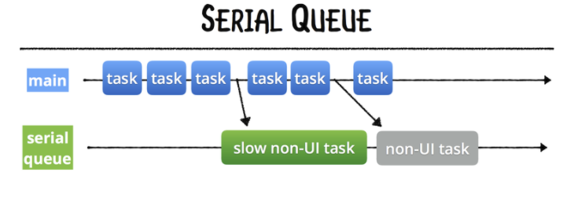
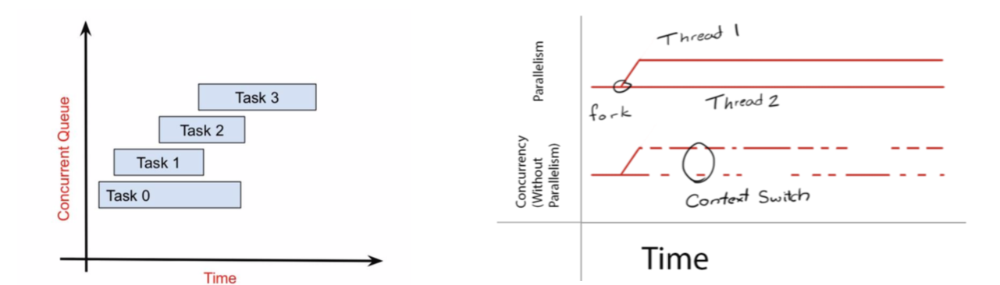

# GCD là gì ? 
   - như là một API* cấp thấp sử dụng để quản lí : 
   + xử lí đồng bộ - bất đồng bộ băng cách quản lí và cung cấp các queue(hàng chờ) cho các task
  
   (API: kết nối giưa thư viện và ứng dung - application programming interface)
## Dispatch Queue là gì? - quản lí nhé
-  là  queue(hàng đợi) tạo ra để: + quản lí và sử lí các task đồng thời hay tuần tự
                                                    + lưu các tash sẽ được thực thi + xử lí theo thứ tự FIFO
                
   - Để sử dụng dispatch queue, chúng ta viết code dưới dạng các block, gán các block vào các dispatch queue để yêu cầu GCD xử lý.
   -  Có 2 loại dispatch queue : serial queue hoặc concurrent queue

vd :  
let concurrentQueue = DispatchQueue(label: "concurrent", attributes: .concurrent) - concurrent Queue
let serialQueue = DispatchQueue(label: "serial" ) - serial Queue

 ### serial queue và concurent queue:
 - serial queue là hàng đợi thực hiện tuần tự, trong một thời điểm - trên cùng một thread
 
 - concurrent queue là hàng đợi thực hiện đồng thời. Trong một thời điểm có thể có nhiều tash thực hiện cùng lúc.
 
trong nó còn có 2 kiểu là :
    + concurrent 
    + Parallelism - 
    
    
## Synchronous vs Asynchronous
     - là cách gửi một tác vụ cho queue 
      + Synchronous : Khi này luồng gọi sẽ phải đợi task kết thúc mới chạy tiếp.
      + synchronous : Luồng gọi sẽ chạy tiếp ngay lập tức mà không đợi task kết thúc.
      
## Queue trong IOS
   - queue là hàng đợi cách công việc theo nguyển tắc FIFO - task nào vào thực hiện trước , sau thực hiện sau.
   - có 3 kiểu :
     + Main Queue
     + Global Queue
     + Custom Queue
 
 ### Main Queue - Global Queue - Custom Queue:
   1.  Main Queue : là SerialQueue 
      + Tất cả các thao tác update view phải dùng trên MainQueue
   2. Global Queue : là ConcurrentQueue, hay còn được gọi là hàng đợi background. Nó được chia sẻ giữa tất cả ứng dụng.
      + Các mức độ ưu tiên (Quality of Service) - tăng dần :
       • background  - hay được sử dụng 
       • utility
       • default - hay được sử dụng 
       • userInitiated
       • UserInteractive  - ngang với main - không cần dưng dùng - load 2 cái cùng lúc giật
       • Unspecified
    
    3. GCD mở rộng
       • Dispatch After
       • DispatchSemaphore
       • DispatchBarrier
       • DispatchGroup

# các vấn đề Multi Thread
- Data race (Thread safe) : Nói về Array và Dictionary trong ios
- Deadlock
# ro hon xem :
https://techblog.vn/grand-central-dispatch-part-1

#  Custom concurrent: 
- after - cho vào 1 hàng sau bao nhiêu thời gian thì nó lại cho 1 sp trong hàng ra
- semafor - DispatchSemaphore(value: 2)//value = 2 toi da so luong chay qua no ( chi 2 thằng được vao) - đợi thằng vào tính xong thì mới cho thằng tiếp vào
- berrier  - Dispatchbarrer : đản bảo thời điểm barrer(task- có 1 barrer) trong conser thành serial thành 1 queue - sau đó các task sau bắt đầu
- group - DispatchGroup - manh hon barrer
 
